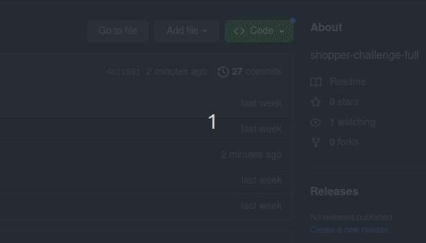

# Projeto FullStack com React, NodeJs e MongoDB

Neste projeto foi desenvolvido um formulário de cadastro para pedidos de supermercado.
Existem campos para o usuário inserir seu nome, a data de entrega desejada e selecionar produtos que irão compor uma lista.
Também é possível visualizar o valor total do pedido, bem como aumentar, diminuir e excluir a quantidade do produto selecionado.

Ao clicar no botão **"Finalizar cadastro de pedidos"** as informações inseridas são salvas em um banco de dados, atualizando a quantidade em estoque.

## 🚀 Começando

Para que você consiga acessar o projeto, siga as instruções abaixo:

- [ ] Faça um clone do projeto em sua máquina utilizando o código SSH;

<p align="center">
  
 </p>

- [ ] Entre na pasta raiz do projeto (project-full) e navegue até a pasta *Server*. 
No terminal rode o comando abaixo para que todas as dependências do projeto sejam instaladas;


```bash
npm install
```
- [ ] Entre na pasta raiz do projeto (project-full) e navegue até a pasta *Client*. 
No terminal rode o comando abaixo para que todas as dependências do projeto sejam instaladas;


```bash
npm install
```

- [ ] Para ter acesso ao localhost do Front, navegue até a pasta chamada *Client* e no terminal rode o comando abaixo. O localhost:5173 ficará disponível. Acesse o link para visualizar a aplicação;

```bash
npm start
```
- [ ] Para ter acesso às APIS criadas nesse projeto, navegue até a pasta chamada *Server* e no terminal rode o comando abaixo. 
O localhost:3001 ficará disponível com os endpoints: '/products' e '/client-request'. 


```bash
npm start
```

## 🛠️ Como esse projeto foi desenvolvido?

**Tecnologias utilizadas:**
<br>

&nbsp;


**FRONT-CLIENT**
<br>


**BACK-SERVER**
<br>

&nbsp;
&nbsp;
- MongoDB Atlas - salva o DB em Cloud
- Postman: utilizado para testar a API, simulando o Front

**ESTILIZAÇÃO:**
<br>

&nbsp;

**DEPENDÊNCIAS INSTALADAS:**
<br>

&nbsp;

- Express 
- Mongoose

## :ballot_box_with_check: Escolhas do processo de desenvolvimento:

### Vite: 
O Vite vem ganhando espaço, se tornou uma escolha padrão para iniciar projetos em React.
### React: 
O React é uma biblioteca que facilita o desenvolvimento de aplicações, trazendo dinamismo a página. Além disso, com ele podemos componentizar a aplicação ao máximo com o intuito de reutilizar os códigos sem necessidade de repetí-los em outras partes do projeto.
### Context API: 
Gerenciador de estados que vem integrado ao React, dispensando a instalação de dependências. Escolhido nesse projeto pois não foi necessário a criação de muitas páginas e componentes.
### NodeJS: 
Tecnologia que vem ganhando muita popularidade no BackEnd, além de ser um ambiente que suporta JavaScript (linguagem que mais tenho conhecimento no momento).
### Express: 
É o framework de desenvolvimento de API mais utilizado com o NodeJS. Ajuda a organizar e construir as APIs.
O Express trata e retorna as requisições feitas ao DB.
### Nodemon: 
Atualiza o banco de dados em real time, a cada vez que o projeto é salvo.
### MongoDB: 
Banco de dados não relacional, não sendo necessário uma estrutura muito rígida. Nesse projeto por exemplo não temos tanto volume de dados.
### Mongoose: 
Faz a conexão com o Mongo e facilita o trabalho na criação de APIS, tratando as requisições e enviando respostas aos endpoints. Disponibiliza os métodos CRUD(Create, Read, Update, Delete) para serem usados no banco de dados.
### SASS: 
Torna mais fácil o desenvolvimento de estilização da aplicação tornando possível criar variáveis que podem ser reutilizadas no código.

## 🎁 Maiores desafios e aprendizados:

O maior desafio enfrentado nesse projeto pode ser considerado também como o meu maior aprendizado. 
O fato de eu estar no início do módulo de BackEnd no curso, me trouxe muitos desafios...
Foi preciso ver alguns vídeos, fazer muitas pesquisas e pedir um direcionamento para quem já é familiarizado no assunto. Dessa maneira pude começar a desenvolver o banco de dados.
Em minha opinião isso é o que mais me motiva na área de tecnologia. A cada desafio temos um novo aprendizado fazendo com que nós desenvolvedores sejamos independentes e 'donos do próprio código'.
Também é muito importante desenvolver nossas Soft Skills pois é necessário sermos resilientes com as situações do dia a dia e constantes com nosso aprendizado.


## :pushpin:  Referências utilizadas:

### Consultas:

**[Freecodecamp](https://www.freecodecamp.org/portuguese/news/introducao-ao-mongoose-para-mongodb/)** para mais informações sobre Mongoose.

**[Como criar uma API Rest com NodeJs e MongoDB](https://www.youtube.com/watch?v=K5QaTfE5ylk)** 

**[Introdução Express - NodeJS](https://developer.mozilla.org/pt-BR/docs/Learn/Server-side/Express_Nodejs/Introduction)** 

**[Roteamendo no Express](https://expressjs.com/pt-br/guide/routing.html)** 

**[Introdução ao Mongoose para MondoDB](https://www.freecodecamp.org/portuguese/news/introducao-ao-mongoose-para-mongodb/)** 


